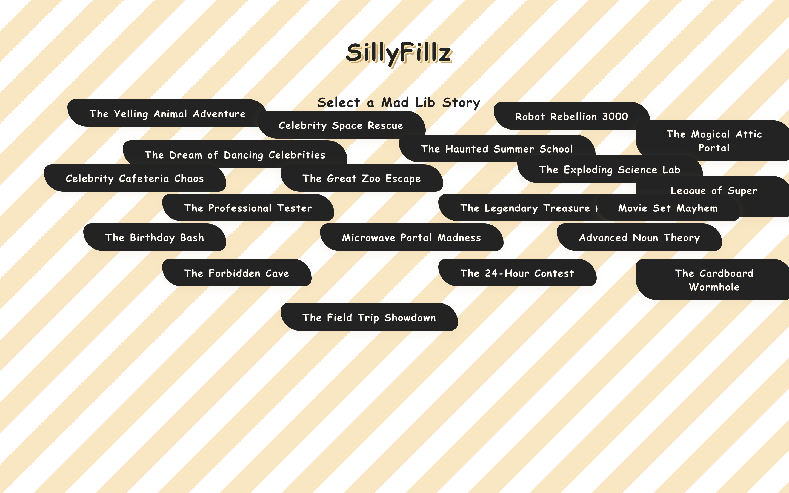

# MadLibs Story Maker

[](https://github.com/Ronyboxer/madlibs-story-maker/actions/workflows/ci.yml)

A fill-in-the-blank story generator. Pick a story, type a word for each blank,
and the finished story is assembled from what you entered.

Live: https://madlibs-story-maker.vercel.app



## How it works

Stories live in `src/pages/madLibTemplates.js` as plain objects, a title and a
template string with blanks marked in square brackets:

```js
{
  title: "Robot Rebellion 3000",
  template: "In the year [number], robots ruled the world and forced all
             humans to [verb] in the [place]..."
}
```

Nothing else knows what the blanks are in advance. `ChooseMadLibs.jsx` pulls
them out of the template at runtime with a single regex:

```js
Array.from(template.matchAll(/\[([^\]]+)\]/g)).map(m => m[1])
```

The form is then generated from that list. Adding a story means adding one
object to the templates file. No form code changes, no new component, no
registry to update. That is the part of this project I would keep if I rebuilt
it.

## The flow

| Step | Component |
|---|---|
| Pick a story from the list | `MadLibSelector.jsx` |
| Fill in one input per blank | `PlaceholderForm.jsx` |
| Read the finished story | `StoryResult.jsx` |

`ChooseMadLibs.jsx` holds the step state and passes data between the three.

There are currently 20 templates. Blanks repeat within a story, so the same
`[place]` you typed at the start comes back at the end, which is what makes the
results read like an actual story instead of a word list.

## Run it

```bash
npm install
npm run dev
```

React and Vite. No backend, no state library, no dependencies beyond React
itself.

## What I would do next

- Let people share a finished story with a link, by encoding the inputs in the URL
- Group the blanks by type so you are not asked for a noun five separate times
- Add validation, since an empty input currently renders an empty gap
